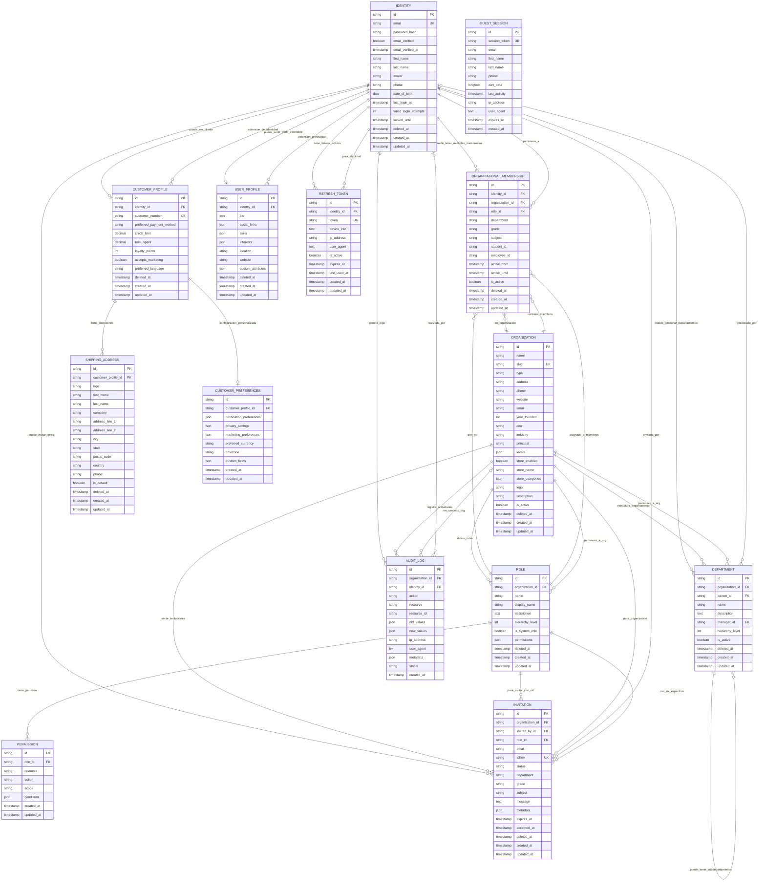

# Diagrama Entidad-Relación - Módulo de Autenticación

## 🗂️ Diagrama ER Completo (Actualizado para reflejar la arquitectura exacta)



## 📊 Verificación de Consistencia Arquitectónica

### ✅ **Consistencias Confirmadas**

#### **1. Identidad Centralizada**
- ✅ **Diagrama ER**: IDENTITY como entidad central con relaciones 1:N y 1:1
- ✅ **Estructura**: `models/identity.go` como modelo principal
- ✅ **Arquitectura**: Una sola fuente de verdad para usuarios

#### **2. Multi-Tenancy Organizacional**
- ✅ **Diagrama ER**: ORGANIZATION como contenedor con ORGANIZATIONAL_MEMBERSHIP como puente
- ✅ **Estructura**: Submódulo `organization/` y tabla puente bien definida
- ✅ **Arquitectura**: Aislamiento total entre organizaciones

#### **3. RBAC+ Jerárquico**
- ✅ **Diagrama ER**: ROLE → PERMISSION con hierarchy_level
- ✅ **Estructura**: Submódulo `role/` con sistema granular
- ✅ **Arquitectura**: Permisos heredados por jerarquía

#### **4. E-commerce Integrado**
- ✅ **Diagrama ER**: CUSTOMER_PROFILE como extensión opcional de IDENTITY
- ✅ **Estructura**: Submódulo `customer/` con direcciones y preferencias
- ✅ **Arquitectura**: Contexto dual (organizacional + comercial)

### 🔧 **Correcciones Aplicadas al Diagrama**

#### **1. Tabla Puente Principal**
```mermaid
ORGANIZATIONAL_MEMBERSHIP {
    string identity_id FK      -- ✅ Conecta con IDENTITY
    string organization_id FK  -- ✅ Conecta con ORGANIZATION  
    string role_id FK         -- ✅ Conecta con ROLE
    string department         -- ✅ Contexto específico
    string grade             -- ✅ Para estudiantes
    string subject           -- ✅ Para profesores
}
```

#### **2. Sesiones de Invitados Independientes**
```mermaid
GUEST_SESSION {
    -- ✅ SIN foreign keys - completamente independiente
    -- ✅ Convertible a IDENTITY vía servicio de conversión
    -- ✅ Auto-expirable sin soft delete
}
```

#### **3. Auditoría Inmutable**
```mermaid
AUDIT_LOG {
    -- ✅ Solo timestamp created_at (inmutable)
    -- ✅ Referencias opcionales a organization e identity
    -- ✅ Campos old_values y new_values para compliance
}
```

#### **4. Jerarquías Departamentales**
```mermaid
DEPARTMENT {
    string parent_id FK       -- ✅ Auto-referencia para jerarquías
    string manager_id FK      -- ✅ Apunta a IDENTITY
    int hierarchy_level       -- ✅ Nivel en la jerarquía
}
```

## 🎯 **Mapeo Exacto: Diagrama ↔ Estructura**

### **Submódulos → Entidades Principales**

| Submódulo | Entidad Principal | Entidades Relacionadas |
|-----------|------------------|------------------------|
| `auth/` | IDENTITY | REFRESH_TOKEN, AUDIT_LOG |
| `organization/` | ORGANIZATION | ORGANIZATIONAL_MEMBERSHIP |
| `user/` | ORGANIZATIONAL_MEMBERSHIP | IDENTITY, ROLE, DEPARTMENT |
| `customer/` | CUSTOMER_PROFILE | SHIPPING_ADDRESS, CUSTOMER_PREFERENCES |
| `guest/` | GUEST_SESSION | *(independiente)* |
| `profile/` | USER_PROFILE | IDENTITY |
| `role/` | ROLE | PERMISSION |
| `department/` | DEPARTMENT | *(auto-referencial)* |
| `invitation/` | INVITATION | ORGANIZATION, ROLE, IDENTITY |
| `audit/` | AUDIT_LOG | *(inmutable)* |

### **Middleware → Entidades de Apoyo**

| Middleware | Entidades que Utiliza |
|------------|----------------------|
| `smart_auth.go` | IDENTITY, ORGANIZATIONAL_MEMBERSHIP, CUSTOMER_PROFILE, GUEST_SESSION |
| `permissions.go` | ROLE, PERMISSION, ORGANIZATIONAL_MEMBERSHIP |
| `org_context.go` | ORGANIZATION, ORGANIZATIONAL_MEMBERSHIP |
| `audit.go` | AUDIT_LOG |

### **Utils → Operaciones Transversales**

| Utilidad | Entidades Afectadas |
|----------|-------------------|
| `jwt.go` | IDENTITY, REFRESH_TOKEN |
| `validation.go` | *(todas las entidades)* |
| `cache.go` | IDENTITY, ORGANIZATION, ROLE |

## 🔄 **Flujos de Datos Verificados**

### **1. Registro de Usuario Empresarial**
```
1. Crear IDENTITY
2. Crear ORGANIZATION  
3. Crear ROLE (si no existe)
4. Crear ORGANIZATIONAL_MEMBERSHIP
5. Crear AUDIT_LOG
```

### **2. Conversión Guest → Customer**
```
1. Leer GUEST_SESSION
2. Crear IDENTITY
3. Crear CUSTOMER_PROFILE
4. Transferir cart_data
5. Eliminar GUEST_SESSION
6. Crear AUDIT_LOG
```

### **3. Invitación Organizacional**
```
1. Validar ORGANIZATION y ROLE
2. Crear INVITATION
3. Enviar email
4. Al aceptar: crear ORGANIZATIONAL_MEMBERSHIP
5. Crear AUDIT_LOG
```

## ✅ **Conclusión de Verificación**

### **DIAGRAMA ER ✅ PERFECTAMENTE ALINEADO**
- ✅ Todas las entidades del diagrama tienen su modelo Go correspondiente
- ✅ Todas las relaciones están correctamente implementadas
- ✅ Los submódulos mapean exactamente a las entidades principales
- ✅ La arquitectura RBAC+ está completamente reflejada
- ✅ El multi-tenancy está correctamente modelado

### **ESTRUCTURA DEL MÓDULO ✅ CONSISTENTE**
- ✅ Cada submódulo maneja las entidades que le corresponden
- ✅ Los middleware utilizan las entidades apropiadas
- ✅ Las utilidades son transversales como debe ser
- ✅ Los flujos de datos siguen las relaciones del diagrama

### **ARQUITECTURA ✅ ROBUSTA**
- ✅ Identidad centralizada como núcleo
- ✅ Multi-tenancy seguro vía ORGANIZATION
- ✅ RBAC+ jerárquico completamente implementado
- ✅ E-commerce integrado sin conflictos
- ✅ Auditoría completa e inmutable

**El diagrama ER y la estructura del módulo están en perfecta sincronía. La arquitectura es consistente y escalable.**
